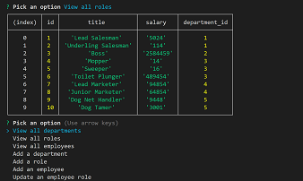

# Employee-Management-System

## Description

This wonderful little Node app is handy for viewing and adding employee's and their
information to a database.

## Features

User is guided via a series of prompts to either view the various departments within the database and/or
is prompted to add new employees, roles, and departments to the database.
This is done through the use of a Node interface that allows basic navigation and input controls

## Installation

Install inquirer, Express, and MYSQL2 to use properly.

## Links

<a href="https://vilas-izquierdo.github.io/Employee-Management-System/">Deployed Page</a>

<a href="https://github.com/vilas-izquierdo/Employee-Management-System">GitHub</a>